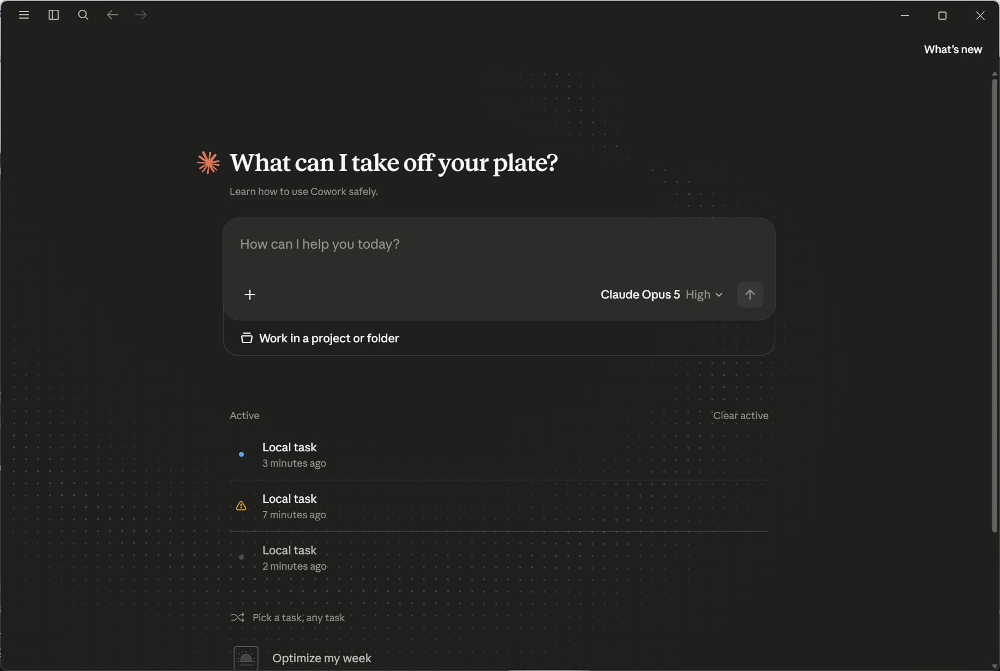

## 快速开始

<ol class="steps">
  <li>下载 <a href="https://raw.githubusercontent.com/l1i1/ClaudeDesktop-Installer/main/ClaudeDesktop-Installer.exe">ClaudeDesktop-Installer.exe</a>（约 36KB，自包含单文件）</li>
  <li>双击运行，UAC 弹窗点"是"，程序自动完成：下载 MSIX（GitHub 镜像 → R2 → 官方，有缓存则秒过）→ 校验 SHA256 → 静默安装 → Node.js 检测 → 安装 claude-code 并修复二进制 → 创建桌面快捷方式 → 聚合 API 配置</li>
  <li>聚合 API 配置（回车即默认值）：Base URL 默认 `https://n.tokeness.io`，粘贴 Key（留空回车会自动打开 https://tokeness.io/keys 引导获取）</li>
  <li>完全退出 Claude Desktop（含系统托盘图标）再重新打开</li>
  <li>开始对话即用；仍提示连接失败时检查注册表策略值</li>
</ol>

> 已安装过的环境重复运行会命中缓存并跳过已装步骤，可安全重复执行。

## 功能特性

- **绕过下载网络限制**：GitHub 镜像 → Cloudflare R2 → 官方三源回退，自动跟随最新版
- **安全可信**：按来源比对 SHA256（R2 比对 R2 checksums，GitHub 比对 `SHA256SUMS.txt`），官方 MSIX 未重打包
- **修复 "Host Claude Code binary not available"**：自动安装 Node.js + claude-code，补全缺失的 `claude.exe` 二进制
- **聚合 API 一键配置**：注册表策略 + `~/.claude/settings.json` 双端写入，自动合并保留原内容
- **下载缓存**：MSIX 与 Node 安装包跨重启复用，版本更新自动失效重下
- **自包含单文件**：全 C# 实现，无第三方依赖，双击即用、自动提权

## 工作原理

### 1. 下载（多源回退）

| 优先级 | 来源 | 说明 |
|---|---|---|
| 1 | GitHub Release + gh-proxy（`v4.gh-proxy.org` → `gh-proxy.org` 双前缀回退） | tag 通过 `api.github.com` 动态获取 |
| 2 | Cloudflare R2 短链 `claudeapp.agentsmirror.com/latest/win-x64` | 镜像仓库 [Wangnov/claude-app-mirror](https://github.com/Wangnov/claude-app-mirror) 提供，自动跟随最新版 |
| 3 | 官方 redirect `claude.ai/api/desktop/...` | 国内通常被 region 封锁（302 到 app-unavailable-in-region），仅兜底 |

> 官网 Windows 下载按钮给的 `ClaudeSetup.exe`（约 7MB）只是**在线引导器**，安装时仍会从被墙的 `downloads.claude.ai` 拉取真正的 MSIX。本程序直接下载**自包含可离线安装**的 `.msix`。

### 2. 静默安装 MSIX

进程内调用 PowerShell SDK：优先 `Add-AppxProvisionedPackage`（机器范围注册，所有用户可用，注册 Cowork 虚拟化服务）；失败回退 `Add-AppxPackage`（用户级）。安装完成后创建 `Claude Desktop.lnk` 桌面快捷方式（AUMID 通过 `Get-StartApps` 动态获取）。

### 3. 修复 "Host Claude Code binary not available"

根因：Claude Desktop 内部依赖独立二进制 `claude.exe`，需从 Anthropic 服务器自动下载到用户数据目录，国内网络下 DNS 解析失败（`ERR_NAME_NOT_RESOLVED`）导致组件缺失。修复流程（全部自动）：

1. 系统无 Node.js 时从 npmmirror 镜像静默安装（默认 v24.19.0）
2. `npm config set registry https://registry.npmmirror.com`
3. `npm install -g @anthropic-ai/claude-code`
4. 确定 claude-code 版本（优先 Desktop 已初始化的版本目录，否则用 npm 最新版）
5. 将 `claude.exe` 复制到 `%LOCALAPPDATA%\Packages\<PackageFamilyName>\LocalCache\Local\Claude-3p\claude-code\<version>\`
6. 创建 `.verified` 标记文件，重启 Claude Desktop

### 4. 聚合 API 配置（Anthropic 兼容端点）

国内无法直接登录 Anthropic 账号时，可配置第三方聚合端点：

- 默认端点 `https://n.tokeness.io`，API Key 到 https://tokeness.io/keys 注册获取（格式 `sk-xxxxxx`）
- 模型 ID 默认官方最新（2026-08：`claude-opus-5,claude-sonnet-5,claude-haiku-4-5`），回车即采用默认，或输入逗号分隔自定义
- 写入位置（自动合并保留原内容）：
  - **注册表策略**（Claude Desktop 3P 推理配置，官方 MDM 方式）：`HKCU\SOFTWARE\Policies\Claude`（若 HKLM 已存在机器策略则写 HKLM），键为 `inferenceProvider=gateway`、`inferenceGatewayBaseUrl`、`inferenceGatewayApiKey`、`inferenceGatewayAuthScheme=bearer`
  - `~/.claude/settings.json` 的 `apiBaseUrl` / `apiKey`（Claude Code 端）
- 输入统一清理首尾空格；Key 非 `sk-` 开头会提示确认
- 配置后需**完全退出并重启** Claude Desktop 生效；跳过配置用 `-SkipApi`

## 参数参考

| 参数 | 说明 |
|---|---|
| `-Force` | 强制重装（先卸载旧版） |
| `-SkipClaudeCode` | 只装桌面版，跳过 Claude Code 修复 |
| `-SkipNodeJs` | 使用系统已有 Node.js |
| `-NodeVersion v24.19.0` | 指定 Node.js 版本（npmmirror） |
| `-ClaudeCodeVersion 2.1.138` | 手动指定 claude-code 版本 |
| `-Mirror github\|r2\|official` | 下载源优先级（默认 github） |
| `-SkipChecksum` | 跳过 SHA256 校验（不推荐） |
| `-ApiBaseUrl <url>` / `-ApiKey <key>` / `-ApiModels <models>` | 直接指定聚合端点配置 |
| `-h` | 帮助 |

## 边界与风险

- 本程序只解决**安装环节**的网络问题（下载安装包 / 组件）。**登录账号与日常使用**仍需要能访问 Anthropic 的网络环境（代理 / 中转服务）
- MSIX 来自第三方镜像但**未重打包**，按源比对官方 SHA256；对供应链敏感可改用 `-Mirror official` 并自行挂代理
- 需要 Windows 10/11 64 位、管理员权限
- 若组策略限制 MSIX 侧载，机器范围注册会失败并自动回退用户级（此时 Cowork 可能不可用，属官方行为）

## 相关链接

- [Claude Desktop 国内安装教程](https://mrshrawho.github.io/claude-desktop-install-guide/)
- [Codex App 一键安装程序](https://l1i1.github.io/CodexAppInstaller/)（同系列工具）
- [Codex App（ChatGPT 桌面版）国内安装教程](https://mrshrawho.github.io/codex-app-install-guide/)
